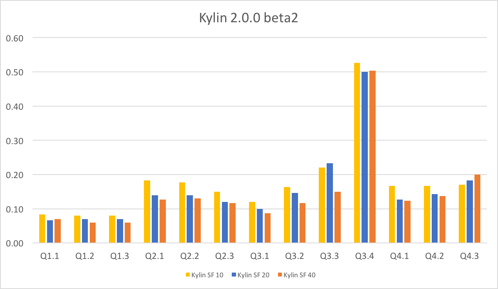
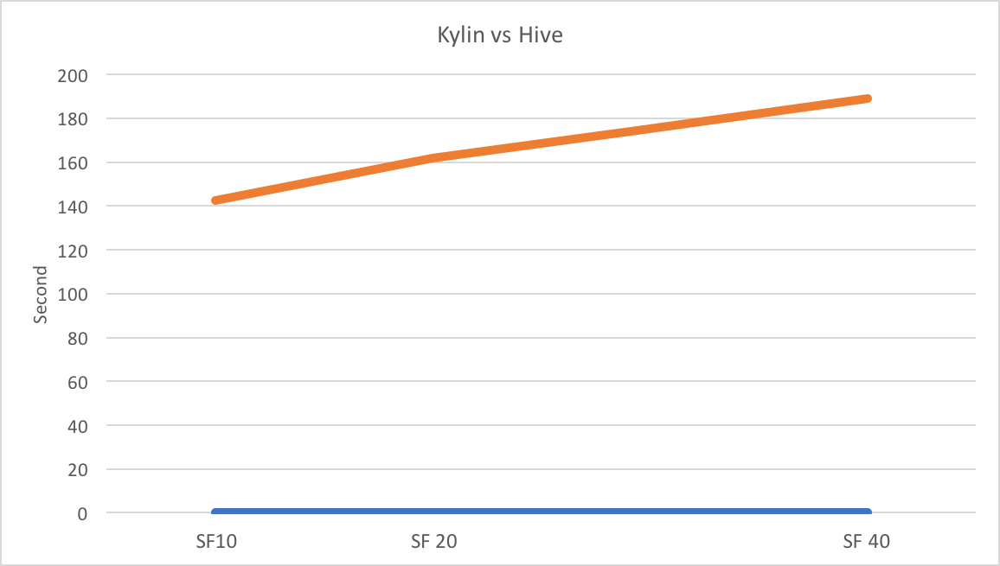

# Star Schema Benchmark on Apache Kylin

The Star Schema Benchmark, or SSB, was devised to evaluate database system performance of star schema data warehouse queries. The schema for SSB is based on the [TPC-H benchmark](http://www.tpc.org/tpch/), but in a modified form. The queries are also based on the TPC-H queries, but the number of queries is reduced to make it easy for individuals to run SSB on different platforms. The SSB has been used to measure a number of major commercial database products on Linux.

Read more about the Star Schema Benchmark: [Paper Download](http://www.cs.umb.edu/~poneil/StarSchemaB.pdf)

**Table Schema of SSB**


The remaining of this document is steps to run SSB on Apache Kylin and experiment results.

## 1. Configuration Parameters

Before we start, you could adjust parameters to customize the SSB data set that is going to be generated. The default setting generates the standard SSB data set and produces comparable result to other SSB tests.

We extended [the original SSB-DBGen](https://github.com/electrum/ssb-dbgen) tools to support column cardinality configuration.

**SCALE** is the key scale factor，ranging from 0.01 to 100+. Default value is 0.1.

Other properties in `bin/ssb.conf`:

- **customer_base**, **part_base**, **supply_base**, **date_base** and **lineorder_base** are used to set the *base row number* for each table (*customer*, *part*, *supply*, *date*, *lineorder*). *date* table's row number is **data_base**, while others' row number = *base row number* * *scale factor*.


- **maux_max**, **cat_max**, **brand_max** are used to define the hierarchy  scale.  For example, **maux_max**=10, **cat_max=10**, **brand_max=10** means total 10 manufactures, and each manufacture has most 10 category parts, and each category has most 10 brands. So the cardinality for the *manufacture* is 10, for *category* is 100, for *brand* is 1000.


- **cust_city_max** and **supp_city_max** are used to define the number of city for each country in *customer* and *supplier* tables. If the total country is 30, and **cust_city_max=100**, **supp_city_max=10**, the *customer* table will have 3000 different cities, the *supplier* table will have 300 different cities.


The data generation executes in YARN, please increase YARN container memory if you hit memory issue.

## 2. Generate Data

1. Compile SSB-Benchmark

   ```shell
   # git clone this repo
   cd ssb-benchmark
   make clean
   make
   ```

2. Define the environment variable `HADOOP_STREAMING_JAR`. If you could not found this jar in your environment. You can use the jar in `ssb-kylin/lib/hadoop-streaming.jar`.

   ```shell
   export HADOOP_STREAMING_JAR=/usr/hdp/<version>/hadoop-mapreduce-client/hadoop-streaming.jar
   ```

3. Generate Data and Import into Hive

   ```shell
   cd ..
   bin/run.sh
   ```

   If want to change the *scale factor* to 10:

   ``` shell
   bin/run.sh --scale 10
   ```

4. Make sure that data has already be created

   ```shell
   hive
   use ssb;
   show tables;
   select count(*) from p_lineorder;
   ```
   Six Hive external tables are created: *customer*, *dates*, *part*, *supplier* and *lineorder*. The sixth table is *p_lineorder* which is the partitioned table for *lineorder*. 

## 3. Load & Build Cube

The Kylin project, model and cube has been designed in advance, you could import it into Kylin directly. The *Cube Metadata* locates under `cubemeta` directory.

Run the following commands to import the `cubemeta` definition:

```shell
$KYLIN_HOME/bin/metastore.sh restore cubemeta
```

Restart Kylin or click ``Reload Metadata``. 

You could find new project `ssb`. Select the project `ssb`, click *Disable* and *Purge* on the *ssb* cube at *Model* Tab to remove all old tempory files. And click *Build* next. The cube build will be finished in a few minutes.

## 4. Query

Here is a list of SSB queries, the query parameter may be different between different *scale factor*. The sample data is generated randomly. 

*Notice that the queries may be slightly different for different scale factor in the filtering constants. The queries below are tested with scale factor 10.*

##### Q1.1

```sql
select sum(v_revenue) as revenue
from p_lineorder
left join dates on lo_orderdate = d_datekey
where d_year = 1993
and lo_discount between 1 and 3
and lo_quantity < 25;
```

##### Q1.2

```sql
select sum(v_revenue) as revenue
from p_lineorder
left join dates on lo_orderdate = d_datekey
where d_yearmonthnum = 199401
and lo_discount between 4 and 6
and lo_quantity between 26 and 35;
```
##### Q1.3

```sql
select sum(v_revenue) as revenue
from p_lineorder
left join dates on lo_orderdate = d_datekey
where d_weeknuminyear = 6 and d_year = 1994
and lo_discount between 5 and 7
and lo_quantity between 26 and 35;
```
##### Q2.1

```sql
select sum(lo_revenue) as lo_revenue, d_year, p_brand
from p_lineorder
left join dates on lo_orderdate = d_datekey
left join part on lo_partkey = p_partkey
left join supplier on lo_suppkey = s_suppkey
where p_category = 'MFGR#12' and s_region = 'AMERICA'
group by d_year, p_brand
order by d_year, p_brand;
```
##### Q2.2

```sql
select sum(lo_revenue) as lo_revenue, d_year, p_brand
from p_lineorder
left join dates on lo_orderdate = d_datekey
left join part on lo_partkey = p_partkey
left join supplier on lo_suppkey = s_suppkey
where p_brand between 'MFGR#2221' and 'MFGR#2228' and s_region = 'ASIA'
group by d_year, p_brand
order by d_year, p_brand;
```
##### Q2.3

```sql
select sum(lo_revenue) as lo_revenue, d_year, p_brand
from p_lineorder
left join dates on lo_orderdate = d_datekey
left join part on lo_partkey = p_partkey
left join supplier on lo_suppkey = s_suppkey
where p_brand = 'MFGR#2239' and s_region = 'EUROPE'
group by d_year, p_brand
order by d_year, p_brand;
```
##### Q3.1

```sql
select c_nation, s_nation, d_year, sum(lo_revenue) as lo_revenue
from p_lineorder
left join dates on lo_orderdate = d_datekey
left join customer on lo_custkey = c_custkey
left join supplier on lo_suppkey = s_suppkey
where c_region = 'ASIA' and s_region = 'ASIA'and d_year >= 1992 and d_year <= 1997
group by c_nation, s_nation, d_year
order by d_year asc, lo_revenue desc;
```
##### Q3.2

```sql
select c_city, s_city, d_year, sum(lo_revenue) as lo_revenue
from p_lineorder
left join dates on lo_orderdate = d_datekey
left join customer on lo_custkey = c_custkey
left join supplier on lo_suppkey = s_suppkey
where c_nation = 'UNITED STATES' and s_nation = 'UNITED STATES'
and d_year >= 1992 and d_year <= 1997
group by c_city, s_city, d_year
order by d_year asc, lo_revenue desc;
```
##### Q3.3

```sql
select c_city, s_city, d_year, sum(lo_revenue) as lo_revenue
from p_lineorder
left join dates on lo_orderdate = d_datekey
left join customer on lo_custkey = c_custkey
left join supplier on lo_suppkey = s_suppkey
where (c_city='UNITED KI1' or c_city='UNITED KI5')
and (s_city='UNITED KI1' or s_city='UNITED KI5')
and d_year >= 1992 and d_year <= 1997
group by c_city, s_city, d_year
order by d_year asc, lo_revenue desc;
```
##### Q3.4

```sql
select c_city, s_city, d_year, sum(lo_revenue) as lo_revenue
from p_lineorder
left join dates on lo_orderdate = d_datekey
left join customer on lo_custkey = c_custkey
left join supplier on lo_suppkey = s_suppkey
where (c_city='UNITED KI1' or c_city='UNITED KI5') and (s_city='UNITED KI1' or s_city='UNITED KI5') and d_yearmonth = 'Dec1997'
group by c_city, s_city, d_year
order by d_year asc, lo_revenue desc;
```
##### Q4.1

```sql
select d_year, c_nation, sum(lo_revenue) - sum(lo_supplycost) as profit
from p_lineorder
left join dates on lo_orderdate = d_datekey
left join customer on lo_custkey = c_custkey
left join supplier on lo_suppkey = s_suppkey
left join part on lo_partkey = p_partkey
where c_region = 'AMERICA' and s_region = 'AMERICA' and (p_mfgr = 'MFGR#1' or p_mfgr = 'MFGR#2')
group by d_year, c_nation
order by d_year, c_nation;
```
##### Q4.2

```sql
select d_year, s_nation, p_category, sum(lo_revenue) - sum(lo_supplycost) as profit
from p_lineorder
left join dates on lo_orderdate = d_datekey
left join customer on lo_custkey = c_custkey
left join supplier on lo_suppkey = s_suppkey
left join part on lo_partkey = p_partkey
where c_region = 'AMERICA'and s_region = 'AMERICA'
and (d_year = 1997 or d_year = 1998)
and (p_mfgr = 'MFGR#1' or p_mfgr = 'MFGR#2')
group by d_year, s_nation, p_category
order by d_year, s_nation, p_category;
```
##### Q4.3

```sql
select d_year, s_city, p_brand, sum(lo_revenue) - sum(lo_supplycost) as profit
from p_lineorder
left join dates on lo_orderdate = d_datekey
left join customer on lo_custkey = c_custkey
left join supplier on lo_suppkey = s_suppkey
left join part on lo_partkey = p_partkey
where c_region = 'AMERICA'and s_nation = 'UNITED STATES'
and (d_year = 1997 or d_year = 1998)
and p_category = 'MFGR#14'
group by d_year, s_city, p_brand
order by d_year, s_city, p_brand;
```

## 5. Result

Cluster info:
- 4 nodes; 32 cores, 100 GB memory for each node

Kylin version:
- kylin 2.0.0 beta2

Queries are run multiple times and the average response times are recorded.

#### Result of Kylin 2.0.0 beta2


All query response times are under 600 ms and most of them are under 200 ms. More importantly, Kylin is the same fast regardless of the size of the data set. This confirms that Kylin can achieve O(1) query latency providing the right precalculation is captured by model and cube.

#### Result of Kylin vs. Hive 



The above compares Kylin and Hive running on the same hardware, shows their average response time on each data set. Kylin is a flat line because of its stable response time across all data sets. Hive query takes much longer to complete, the average is 140 seconds at minimal. Also Hive response time increases linearly as the data size grows. This shows that Hive is O(N) in time complexity while Kylin is O(1), where N is the size of data.

