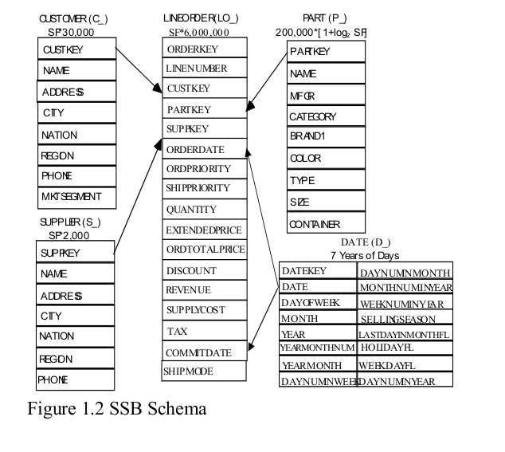
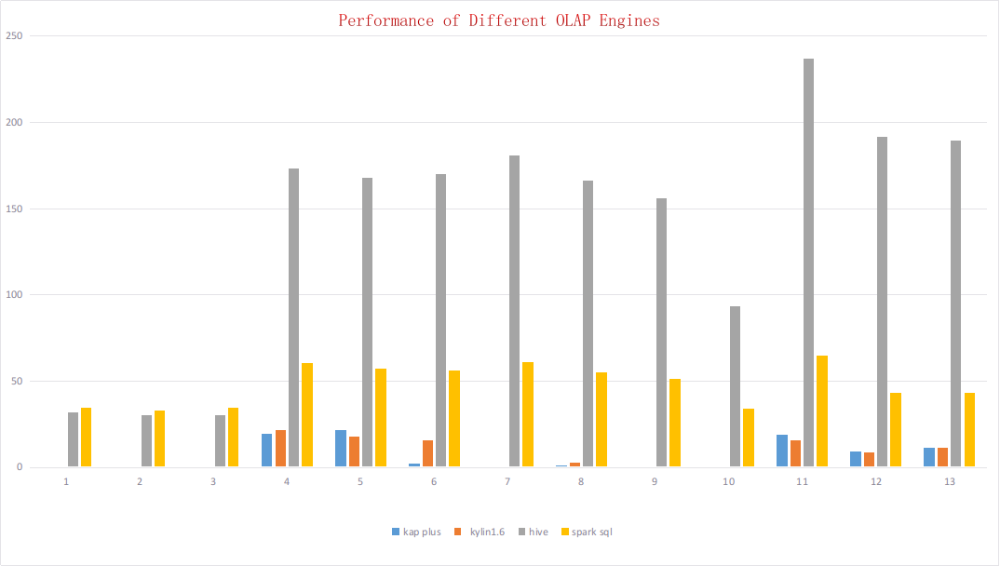

# Star Schema Benchmark Tool for Apache Kylin

##Incroduction to ssb benchmark
The Star Schema benchmark, or SSB, was devised to evaluate database system performance of star schema data warehouse queries. The schema for SSB is based on the TPC-H benchmark, but in a highly modified form. The SSB has been used to measure a number of major commercial database products on Linux to evaluate a new product. The Schema of the Star Schema Benchmark (SSB) is based on that of the TPC-H benchmark. The queries are also based on a few of the TPC-H queries, but the number of queries is rather small to make it easy for individuals to run SSB on different platforms.


schema of ssb benchmark


Read more about Star Schema Benchmark: [PDF Download](http://www.cs.umb.edu/~poneil/StarSchemaB.pdf)

##About this tool
The benchmark tool is built on the original SSB-DBGen(https://github.com/electrum/ssb-dbgen). We extend the tools to support column cardinality configuration.You can test the performance of Apache Kylin in ssb benchmark by using this tool.

#How to use
## 1. Config parameters

**SCALE** is the key scale factor, defined in *bin/dbgen.sh*. Valid range from 0.01 to 100+. Default value is 0.1.

Other properties are defined in *bin/ssb.conf*.

**customer_base**, **part_base**, **supply_base**, **date_base** and **lineorder_base** are used to set the *base row number* for each table(*customer*, *part*, *supply*, *date*, *lineorder*). The total row number = *base row number* * *scale factor*.

**maux_max**, **cat_max**, **brand_max** are used to define the hierarchy  scale.  For example, **maux_max**=10, **cat_max=10**, **brand_max=10** means total 10 manufactures, and each manufacture has most 10 category parts, and each category has most 10 brands. So the cardinality for the *manufacture* is 10, for *category* is 100, for *brand* is 1000.

**cust_city_max** and **supp_city_max** are used to define the number of city for each country in *customer* and *supplier* tables. If the total country is 30, and **cust_city_max=100**, **supp_city_max=10**, the *customer* table will have 3000 different cities, the *supplier* table will have 300 different cities.

If the build job is killed by YARN, please increase YARN container memory settings.


## 2. Generate Data

1. Compile SSB-Benchmark

   ```shell
   cd ssb-benchmark
   make clean
   make
   ```

2. Define the environment variable *HADOOP_STREAMING_JAR*

   ```shell
   export HADOOP_STREAMING_JAR=/usr/hdp/<version>/hadoop-mapreduce/hadoop-streaming.jar
   ```

3. Generate Data and Import into Hive

   ```shell
   cd ..
   bin/run.sh
   ```
   If want to create partitioned Hive tables, please run 

   ```bin/run.sh partition```
4. Make sure that data has already be created
	 ```shell
   hive
   use ssb;
   show tables;
   select count(*) from p_lineorder;
   ```

   


## 3. Load & Build Cube

The Kylin project, model and cube has been designed in advance, you could import it into Kylin directly. The *Cube Metadata* locates under cubemeta directory.

Run the following commands to import the cubemeta definition:

```shell
cd $KYLIN_HOME
bin/metastore.sh restore <path to cubemeta dir>
```

Restart Kylin or click ``Reload Metadata``. 

You could find new project *ssb*. Select the *ssb*, click *Disable* and *Purge* on the *ssb* cube at *Model* Tab to remove all old tempory files. And click *Build* next. The cube build will be finished in a few minutes.

## 4. Query


Six Hive external tables are created: *customer*, *dates*, *part*, *supplier* and *lineorder*. The sixth table is *p_lineorder* which is the partitioned table for *lineorder*. 

Here is a list sample queries, the query parameter may be different between different *scale factor*. The sample data is generated randomly. 

<font color=	#DC143C size=5>notice that the query may be a little different for different scale factor. And queries below are for scale factor 10</font>

##### Q1.1

```sql
select sum(v_revenue) as revenue
from p_lineorder
left join dates on lo_orderdate = d_datekey
where d_year = 1993;
```

##### Q1.2

```sql
select sum(v_revenue) as revenue
from p_lineorder
left join dates on lo_orderdate = d_datekey
where d_yearmonthnum = 199401;
```
##### Q1.3

```sql
select sum(v_revenue) as revenue
from p_lineorder
left join dates on lo_orderdate = d_datekey
where d_weeknuminyear = 6 and d_year = 1994;
```
##### Q2.1

```sql
select sum(lo_revenue) as lo_revenue, d_year, p_brand
from p_lineorder
left join dates on lo_orderdate = d_datekey
left join part on lo_partkey = p_partkey
left join supplier on lo_suppkey = s_suppkey
where p_category = 'MFGR#0702' and s_region = 'AMERICA'
group by d_year, p_brand
order by d_year, p_brand;
```
##### Q2.2

```sql
select sum(lo_revenue) as lo_revenue, d_year, p_brand
from p_lineorder
left join dates on lo_orderdate = d_datekey
left join part on lo_partkey = p_partkey
left join supplier on lo_suppkey = s_suppkey
where p_brand between 'MFGR#04040394' and 'MFGR#04040494' and s_region = 'ASIA'
group by d_year, p_brand
order by d_year, p_brand;
```
##### Q2.3

```sql
select sum(lo_revenue) as lo_revenue, d_year, p_brand
from p_lineorder
left join dates on lo_orderdate = d_datekey
left join part on lo_partkey = p_partkey
left join supplier on lo_suppkey = s_suppkey
where p_brand = 'MFGR#04040394' and s_region = 'EUROPE'
group by d_year, p_brand
order by d_year, p_brand;
```
##### Q3.1

```sql
select c_nation, s_nation, d_year, sum(lo_revenue) as lo_revenue
from p_lineorder
left join dates on lo_orderdate = d_datekey
left join customer on lo_custkey = c_custkey
left join supplier on lo_suppkey = s_suppkey
where c_region = 'ASIA' and s_region = 'ASIA'and d_year >= 1992 and d_year <= 1997
group by c_nation, s_nation, d_year
order by d_year asc, lo_revenue desc;
```
##### Q3.2

```sql
select c_city, s_city, d_year, sum(lo_revenue) as lo_revenue
from p_lineorder
left join dates on lo_orderdate = d_datekey
left join customer on lo_custkey = c_custkey
left join supplier on lo_suppkey = s_suppkey
where c_nation = 'UNITED STATES' and s_nation = 'UNITED STATES'
and d_year >= 1992 and d_year <= 1997
group by c_city, s_city, d_year
order by d_year asc, lo_revenue desc;
```
##### Q3.3

```sql
select c_city, s_city, d_year, sum(lo_revenue) as lo_revenue
from p_lineorder
left join dates on lo_orderdate = d_datekey
left join customer on lo_custkey = c_custkey
left join supplier on lo_suppkey = s_suppkey
where (c_city='UNITED KI040' or c_city='UNITED KI010')
and (s_city='UNITED KI040' or s_city='UNITED KI010')
and d_year >= 1992 and d_year <= 1997
group by c_city, s_city, d_year
order by d_year asc, lo_revenue desc;

```
##### Q3.4

```sql
select c_city, s_city, d_year, sum(lo_revenue) as lo_revenue
from p_lineorder
left join dates on lo_orderdate = d_datekey
left join customer on lo_custkey = c_custkey
left join supplier on lo_suppkey = s_suppkey
where (c_city='UNITED KI040' or c_city='UNITED KI010') and (s_city='UNITED KI040' or s_city='UNITED KI010') and d_yearmonth = 'Mar1997'
group by c_city, s_city, d_year
order by d_year asc, lo_revenue desc;

```
##### Q4.1

```sql
select d_year, c_nation, sum(lo_revenue) - sum(lo_supplycost) as profit
from p_lineorder
left join dates on lo_orderdate = d_datekey
left join customer on lo_custkey = c_custkey
left join supplier on lo_suppkey = s_suppkey
left join part on lo_partkey = p_partkey
where c_region = 'AMERICA' and s_region = 'AMERICA' and (p_mfgr = 'MFGR#01' or p_mfgr = 'MFGR#02')
group by d_year, c_nation
order by d_year, c_nation;
```
##### Q4.2

```sql
select d_year, s_nation, p_category, sum(lo_revenue) - sum(lo_supplycost) as profit
from p_lineorder
left join dates on lo_orderdate = d_datekey
left join customer on lo_custkey = c_custkey
left join supplier on lo_suppkey = s_suppkey
left join part on lo_partkey = p_partkey
where c_region = 'AMERICA'and s_region = 'AMERICA'
and (d_year = 1997 or d_year = 1998)
and (p_mfgr = 'MFGR#01' or p_mfgr = 'MFGR#02')
group by d_year, s_nation, p_category
order by d_year, s_nation, p_category;
```
##### Q4.3

```sql
select d_year, s_city, p_brand, sum(lo_revenue) - sum(lo_supplycost) as profit
from p_lineorder
left join dates on lo_orderdate = d_datekey
left join customer on lo_custkey = c_custkey
left join supplier on lo_suppkey = s_suppkey
left join part on lo_partkey = p_partkey
where c_region = 'AMERICA'and s_nation = 'UNITED STATES'
and (d_year = 1997 or d_year = 1998)
and p_category = 'MFGR#0103'
group by d_year, s_city, p_brand
order by d_year, s_city, p_brand;
```

## 5. Result
cluster info:
```shell
4 nodes
32 cpu, 100G memory for each node
scale factor 10
```
spark config: 
```shell
spark.executor.cores 5
spark.executor.instances 12
spark.executor.memory 8g
spark.driver.memory 8g
```
version:
```shell
kap plus 2.2.0
kylin 1.6.0
spark sql xxx
hive  xxx
```

####Result of q1.1~q4.3



